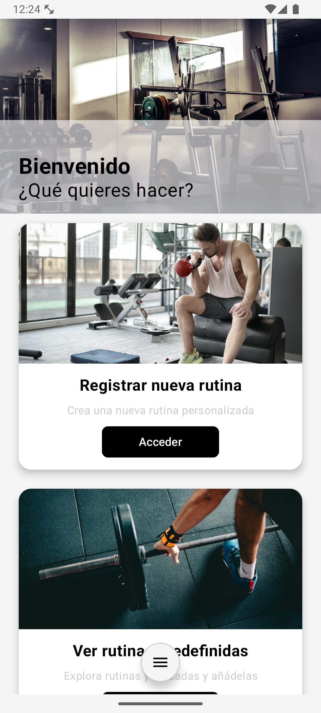
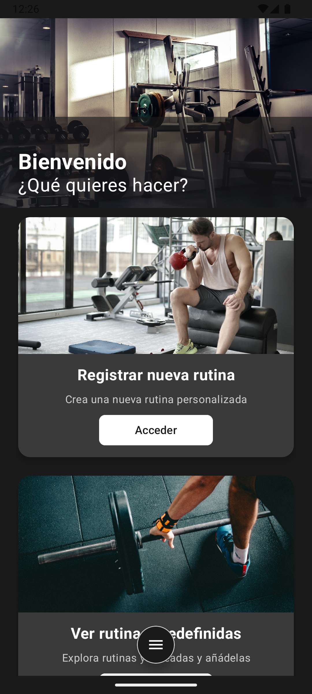

# 💪 GymTrack

GymTrack es una aplicación móvil para gestionar tus rutinas de entrenamiento.  
Permite crear, editar y seguir rutinas personalizadas, consultar rutinas predefinidas, usar temporizadores de entrenamiento y recibir notificaciones push sobre nuevas rutinas disponibles.

|  |  |
|:--:|:--:|
| **Modo claro** | **Modo oscuro** |

---

## 🚀 Funcionalidades principales

✅ Registro y login de usuario  
✅ Gestión de rutinas personalizadas (crear, editar, eliminar)  
✅ Rutinas predefinidas disponibles para todos  
✅ Marcar rutinas como favoritas  
✅ Temporizador integrado para controlar tus ejercicios  
✅ Notificaciones push (Firebase Cloud Messaging)  
✅ Modo oscuro y modo claro

---

## 📲 Tecnologías usadas

- **Kotlin** + Jetpack Compose (Android)  
- **Firebase** (Authentication, Firestore, Cloud Functions, Cloud Messaging)  
- **Material3 Design**  
- **Animaciones suaves** y experiencia visual moderna

---

## 🔧 Instalación y configuración

### 1️⃣ Clona este repositorio:
```bash
git clone https://github.com/AlvaroMoreno39/GymTrack.git
```

### 2️⃣ Abre el proyecto en Android Studio.
### 3️⃣ (Opcional) Configura Firebase y Google Cloud.
Si eres un desarrollador avanzado y quieres conectar tu propia base de datos y notificaciones:

- Crea un proyecto en Firebase Console.

- Descarga el archivo google-services.json y colócalo en la carpeta app/ del proyecto.

- Activa los servicios que quieras (Authentication, Firestore, Cloud Functions, Cloud Messaging).

⚠ Nota: No es necesario configurar Firebase ni Google Cloud para generar y probar la APK básica.
### 4️⃣ Ejecuta el proyecto en un emulador o dispositivo físico.

### 5️⃣ 🔨 Genera el APK para probarlo manualmente.
Si quieres probar la app sin necesidad de conectarte a Firebase:

- En Android Studio, ve a Build → Build APK(s).

- Cuando termine, haz clic en locate para abrir la carpeta donde se generó el archivo:
```lua
app/build/outputs/apk/debug/app-debug.apk
```

### 6️⃣ 📲 Pasa el APK a tu móvil y ejecútalo.
Copia el archivo .apk al almacenamiento del móvil (vía cable USB, Google Drive, email, etc.).

En el móvil, activa la opción Permitir instalar apps de orígenes desconocidos.

Abre el APK desde el administrador de archivos del móvil y sigue los pasos para instalarlo.

#### ⚠ Importante: Este paso solo es necesario si la app no está publicada en Google Play Store.
Si subes GymTrack a Google Play, los usuarios podrán descargarla e instalarla directamente desde la tienda, sin necesidad de transferir el APK manualmente.

---

## 🔔 Notificaciones push (Firebase Cloud Functions)
Este proyecto incluye una función Cloud en Firebase que envía notificaciones a todos los dispositivos suscritos al tópico nuevas_rutinas cuando se crea una nueva rutina predefinida.

### Código de la función (functions/index.js):
```javascript
const { onDocumentCreated } = require("firebase-functions/v2/firestore");
const { initializeApp } = require("firebase-admin/app");
const { getMessaging } = require("firebase-admin/messaging");
const logger = require("firebase-functions/logger");

initializeApp();

exports.notifyNewPredefinedRoutine = onDocumentCreated("rutinasPredefinidas/{docId}", (event) => {
  const data = event.data.data();
  const nombreRutina = data?.nombreRutina || "una rutina";

  const message = {
    notification: {
      title: "💪 ¡Nueva rutina disponible!",
      body: `Se ha publicado ${nombreRutina}`,
    },
    data: {
      title: "💪 ¡Nueva rutina disponible!",
      body: `Se ha publicado ${nombreRutina}`,
    },
    topic: "nuevas_rutinas",
  };

  return getMessaging().send(message)
    .then((response) => {
      logger.info("✅ Notificación enviada con éxito:", response);
    })
    .catch((error) => {
      logger.error("❌ Error al enviar la notificación:", error);
    });
});
```

## 🔧 Cómo desplegar las funciones en tu propio Firebase

### 1️⃣ Instala Firebase CLI (si no lo tienes):
```bash
npm install -g firebase-tools
```

### 2️⃣ Inicia sesión:
```bash
firebase login
```

### 3️⃣ Inicializa las funciones:
```bash
firebase init functions
```

### 4️⃣ Copia el código anterior en functions/index.js.

### 5️⃣ Despliega las funciones:
```bash
firebase deploy --only functions
```

### ✅ ¡Listo! Las notificaciones estarán activas.

---

## 👤 Acceso administrador (solo pruebas)
El sistema tiene un usuario administrador creado manualmente para pruebas internas.

Correo: `admin@gymtrack.com`  
Contraseña: `123456`

---

## ⚠ Importante

Por seguridad, no se incluyen credenciales reales en este repositorio ni se recomienda usar estas credenciales en producción.

---

## 📄 Licencia
Este proyecto está bajo la licencia MIT.
Puedes consultar el archivo LICENSE para más detalles.

---

## 🙌 Contacto
**Desarrollador**: Álvaro Moreno Lumbreras  
**Email**: [amorenolumbreras@gmail.com](mailto:amorenolumbreras@gmail.com)  
**Repositorio GitHub**: [https://github.com/AlvaroMoreno39/GymTrack](https://github.com/AlvaroMoreno39/GymTrack)

---

## 🌟 ¡Gracias por probar GymTrack! Si te gusta el proyecto, no olvides darle ⭐ en GitHub.

